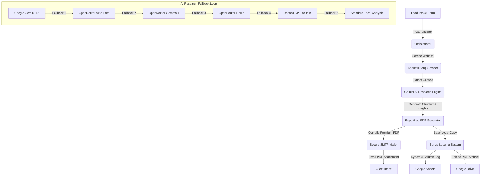

# 🚀 SimplifIQ — AI Lead Intake & Automation System
> **An elite B2B Sales Orchestration Pipeline that scrapes company websites, performs AI audits, generates premium PDF reports, and handles automatic multi-channel logging and delivery.**

---

## 📖 Project Overview
**SimplifIQ** is a production-grade, highly automated lead acquisition and enrichment engine. When a prospect submits their details, the system launches a background worker that scrapes their company website, runs deep business analysis using state-of-the-art LLMs, drafts a tailored business analysis audit, compiles it into a beautiful custom-styled 3-column PDF report, delivers it via Gmail SMTP, logs the details to Google Sheets, and backs up the report to Google Drive.

---

## 🛠️ Architecture & Data Flow



---

## ✨ Features

- **🌐 Deep Web Scraping**: Live extracting of company context using requests and BeautifulSoup4 with smart tag decomposing.
- **🧠 Multi-Model AI Engine**: Real-time business audit powered natively by **Google Gemini 1.5** via the modern `google-genai` SDK.
- **🛡️ Bulletproof Fallback Loop**: 5 levels of sequential provider fallbacks to ensure 100% uptime even during rate-limits or API quotas.
- **📄 Premium 3-Column PDF Designer**: Pixel-perfect custom styling using ReportLab with a curated dark-navy and cobalt palette, grids, spacers, and dynamic typography.
- **✉️ Automated Gmail SMTP**: Integrated standard email delivery with auto-detection for `@gmail.com` senders and Google App Passwords.
- **📊 Google Sheets Logging**: Dynamic `A:F` logging mapping directly to your exact sheet columns without requiring static sheet/tab name definitions.
- **☁️ Google Drive Backup**: Automated backup of compiled lead PDFs to your specified Google Drive archive.
- **🔒 Isolated Execution Blocks**: Complete isolation of Sheets logging and Drive uploads to ensure that an unshared folder or quota limit never blocks lead logging.

---

## 💻 Tech Stack

- **Core Language**: Python 3.11+
- **Backend Framework**: Flask
- **Scraper Engines**: BeautifulSoup4, Requests
- **LLM Integrations**: Native Google GenAI SDK, OpenAI SDK, Anthropic SDK
- **PDF Core**: ReportLab PDF Toolkit
- **Cloud Backup**: Google API Client (`googleapiclient.discovery`, `google-oauth2`)
- **Environment Management**: Python-dotenv

---

## 📂 Project Structure

```text
simplifiq/
├── app.py              # Flask server + Orchestrator pipeline
├── enricher.py         # Web scraping + Gemini / OpenRouter AI analysis
├── pdf_generator.py    # Custom ReportLab PDF compilation
├── mailer.py           # Secure Gmail SMTP mail engine
├── bonus_logger.py     # Google Sheets + Google Drive backup handler
├── templates/
│   └── form.html       # Sleek lead intake frontend template
├── screenshots/        # Visual documentation images
├── .env.example        # Environment variables template
└── requirements.txt    # Python dependencies
```

---

## ⚡ Setup Steps

### 1. Clone & Install Dependencies
First, make sure you have Python 3.11+ installed. Run the command:
```bash
pip install -r requirements.txt
```

### 2. Configure Environment Variables
Copy `.env.example` to `.env` and fill in your keys:
```bash
cp .env.example .env
```

**Required Fields:**
```env
GEMINI_API_KEY=your_gemini_api_key
EMAIL_SENDER=dhruvyadav.y49@gmail.com
EMAIL_PASSWORD=your_gmail_app_password
GOOGLE_SHEET_ID=1yNF7b6bwiYp3Bv87H2Ifor6bgC6Ze0_8aRC_ER6Ai6Q
GOOGLE_DRIVE_FOLDER_ID=1tAxDe8rEdQfamztznyYoT5X2rH73sTNa
```

### 3. Google Services Setup (Sheets & Drive)
1. Go to **Google Cloud Console** and enable **Sheets API** & **Drive API**.
2. Go to **IAM & Admin** -> **Service Accounts** and create a service account.
3. Generate and download a new private key in **JSON** format.
4. Rename this file to `credentials.json` (or leave it as `credentials.json.json`, the code has automatic fallback detection!) and save it in the project root folder.
5. Share your **Google Sheet** and your **Google Drive Folder** with the service account email (found inside the json credentials file) as **Editor**.

### 4. Run the Flask Web Application
Start your development server:
```bash
python app.py
```
Open **`http://127.0.0.1:5000`** in your browser, enter your lead details, and submit!

---

## 🔌 API Endpoints

### 1. Lead Form Landing Page
- **URL**: `/`
- **Method**: `GET`
- **Description**: Renders the modern B2B interactive lead intake form.

### 2. Lead Orchestrator Submission
- **URL**: `/submit`
- **Method**: `POST`
- **Payload Format**: `Form-Data`
- **Fields**:
  - `name`: Prospect's Full Name (Required)
  - `email`: Prospect's Business Email (Required)
  - `company`: Company Name (Required)
  - `website`: Company Website URL (Optional)
  - `role`: Prospect's Current Role (Optional)
- **Response**:
  ```json
  {
    "message": "Report sent successfully to dhruvofficial73@gmail.com!",
    "status": "Sent"
  }
  ```

---

## 📸 Screenshots

### 📊 Real-time Lead Sheet Logging
Perfect column-wise mapping matches `Timestamp | Company Name | Contact Email | Contact Name | Report Status | PDF Link`:


### 📄 Premium Generated PDF Audit Report
Gorgeous 3-Column dynamic ReportLab design with real AI research results:


### 🔑 Google AI Studio Setup
Instantly generated API keys for free-tier Gemini 1.5 Flash:


---

## 🔒 Production Considerations & Security
- **Secure App Passwords**: SMTP credentials use Google's App-specific passwords. Never commit your main account passwords.
- **Service Account Permissions**: The Google Cloud service account is restricted strictly to Google Sheets and Drive permissions using OAuth Scopes.
- **Rate-Limit Protections**: Implements automatic model fallback to avoid being blocked by Google AI Studio or OpenRouter quotas.
- **Credentials Fallback**: The server is designed to detect both `credentials.json` and double-extension `credentials.json.json` to prevent key initialization bugs.
